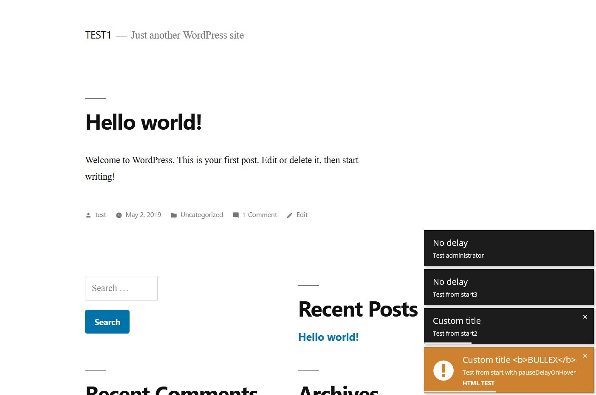

# Exopite Frontend Notifications
## WordPress Plugin
Display frontend notifications thru hooks with lobibox (PHP & AJAX).

- Author: Joe Szalai
- Version: 20191020
- Plugin URL: https://github.com/JoeSz/Exopite-Frontend-Notifications
- Demo URL: https://www.joeszalai.org/exopite/frontend-notifications/
- Author URL: https://joe.szalai.org
- License: GNU General Public License v3 or later
- License URI: http://www.gnu.org/licenses/gpl-3.0.html

DESCRIPTION
-----------

This plugin neither has options nor display anything after activation. You have to use hooks to use this plugin.

Display frontend PHP notifications via 'efn_messages' hook and/or AJAX notifications via 'efn_messages_ajax' hook.

AJAX functionality is disabled by default, you can enable with the 'efn_enable_ajax' hook.

The plugin check AJAX messages every 10 sec. You can change this with 'efn_ajax_inerval' hook.

Check for all options and previews: http://lobianijs.com/site/lobibox#notifications

== How to use ==

ONLY PHP
```php
function my_notifications( $messages ) {

    $my_messages = array(
        array(
            'pauseDelayOnHover' => true,
            'continueDelayOnInactiveTab' => false,
            // 'closeOnClick' => false,
            'delay' => false,
            'closable' => false,
            'title' => 'No delay',
            'msg' => 'Test logged_in',
            'roles_users' => 'logged_in',
            // this is optional, to react on user dismiss, only in AJAX available
        ),
        // ...
    );

    $messages = array_merge( $messages, $my_messages );

    return $messages;
}
add_filter( 'efn_messages_ajax', 'my_notifications' );
```

AJAX
```php
function my_ajax_notifications( $messages ) {

    $my_messages = array(
        array(
            'pauseDelayOnHover' => true,
            'continueDelayOnInactiveTab' => false,
            // 'closeOnClick' => false,
            'delay' => false,
            'closable' => false,
            'title' => 'No delay',
            'msg' => 'Test logged_in',
            'roles_users' => 'logged_in',
            // this is optional, to react on user dismiss, only in AJAX available
            'id' => 'some_id',
            'callback' => 'my_ajax_callback_function', // to remove or react on user dismiss
        ),
        // ...
    );

    $messages = array_merge( $messages, $my_messages );

    return $messages;
}
add_filter( 'efn_messages_ajax', 'my_ajax_notifications' );

function my_ajax_callback_function() {

    $element = $_POST['element]; // The options array for the notification.
    $my_id = $_POST['element][id];

    // do something with the infos.

}

add_action('wp_ajax_my_ajax_callback_function', 'my_ajax_callback_function');
add_action('wp_ajax_nopriv_my_ajax_callback_function', 'my_ajax_callback_function');
```

SCREENSHOT
----------


INSTALLATION
------------

1. [x] Upload `exopite-frontend-notifications` to the `/wp-content/plugins/exopite-frontend-notifications/` directory

OR

1. [ ] ~~Install plugin from WordPress repository (not yet)~~

2. [x] Activate the plugin through the 'Plugins' menu in WordPress

REQUIREMENTS
------------

Server

* WordPress 4.7+ (May work with earlier versions too)
* PHP 7.0+ (Required)

Browsers

* Modern Browsers
* Firefox, Chrome, Safari, Opera, IE 10+
* Tested on Firefox, Chrome, Edge, IE 11

CHANGELOG
---------

= 20191020 =
* Add readme
* Add screenshot

= 20191017 =
* Initial release

LICENSE DETAILS
---------------
The GPL license of Exopite Frontend Notifications grants you the right to use, study, share (copy), modify and (re)distribute the software, as long as these license terms are retained.

DISCLAMER
---------

NO WARRANTY OF ANY KIND! USE THIS SOFTWARES AND INFORMATIONS AT YOUR OWN RISK!
[READ DISCLAMER.TXT!](https://joe.szalai.org/disclaimer/)
License: GNU General Public License v3

[](http://forthebadge.com) [](http://forthebadge.com)
